# Backend - Esquema y Organización de Data

Este documento describe la arquitectura y el diseño lógico del almacenamiento de datos para FocusMind. Se diseñó un esquema relacional unificado compatible tanto con el motor local **SQLite** (usado por los usuarios Premium) como con **PostgreSQL** (usado para el backend en la nube del modo Free).

---

## 1. Estrategia de Compatibilidad de Motores (SQLite & PostgreSQL)
*   **Tipos de Datos Unificados:** Se utilizan tipos de datos estándar que se mapean de manera transparente en ambos gestores.
    *   `SERIAL` (Postgres) / `INTEGER PRIMARY KEY AUTOINCREMENT` (SQLite) para claves primarias numéricas.
    *   `VARCHAR` / `TEXT` para campos de texto.
    *   `TIMESTAMP` (Postgres) / `TEXT` (SQLite en formato ISO 8601 YYYY-MM-DD HH:MM:SS) para fechas y registros de tiempo.
    *   `BOOLEAN` (Postgres) / `INTEGER` (0 o 1 en SQLite) para flags binarios.

---

## 2. Esquema Relacional de Tablas

```mermaid
erDiagram
    USUARIOS ||--o{ HABITOS : posee
    USUARIOS ||--o{ HISTORIAL_DOPAMINA : registra
    USUARIOS ||--|| ESTADO_ENTORNO : tiene
    
    USUARIOS {
        int id PK
        string email UK
        string password_hash
        string tipo_plan
    }
    
    HABITOS {
        int id PK
        int user_id FK
        string nombre
        string descripcion
        boolean estado_actual
        int racha_actual
    }
    
    HISTORIAL_DOPAMINA {
        int id PK
        int user_id FK
        timestamp fecha
        int energia_pre
        int motivacion_pre
        int energia_post
        int motivacion_post
        int bloques_completados
    }
    
    ESTADO_ENTORNO {
        int id PK
        int user_id FK
        int habitacion_level
        string items_ordenados_json
    }
```



---

## 3. Diccionario de Datos y DDLs de Referencia

### 3.1. Tabla: `Usuarios`
Almacena la información de autenticación y el tipo de plan activo.
```sql
-- DDL Referencial (PostgreSQL / SQLite compatible)
CREATE TABLE Usuarios (
    id INTEGER PRIMARY KEY AUTOINCREMENT, -- En Postgres: id SERIAL PRIMARY KEY
    email VARCHAR(255) UNIQUE NOT NULL,
    password_hash VARCHAR(255) NOT NULL,
    tipo_plan VARCHAR(50) DEFAULT 'Free' -- Valores: 'Free', 'Premium'
);
```

### 3.2. Tabla: `Habitos`
Mantiene los hábitos del usuario y su estado de cumplimiento diario.
```sql
CREATE TABLE Habitos (
    id INTEGER PRIMARY KEY AUTOINCREMENT, -- En Postgres: id SERIAL PRIMARY KEY
    user_id INTEGER NOT NULL,
    nombre VARCHAR(100) NOT NULL,
    descripcion TEXT,
    estado_actual BOOLEAN DEFAULT FALSE, -- 0 o 1 en SQLite
    racha_actual INTEGER DEFAULT 0,
    FOREIGN KEY (user_id) REFERENCES Usuarios(id) ON DELETE CASCADE
);
```

### 3.3. Tabla: `Historial_Dopamina`
Registra la telemetría de las sesiones de enfoque y los estados de neuroproductividad.
```sql
CREATE TABLE Historial_Dopamina (
    id INTEGER PRIMARY KEY AUTOINCREMENT, -- En Postgres: id SERIAL PRIMARY KEY
    user_id INTEGER NOT NULL,
    fecha TIMESTAMP DEFAULT CURRENT_TIMESTAMP,
    energia_pre INTEGER CHECK(energia_pre BETWEEN 1 AND 5),
    motivacion_pre INTEGER CHECK(motivacion_pre BETWEEN 1 AND 5),
    energia_post INTEGER CHECK(energia_post BETWEEN 1 AND 5),
    motivacion_post INTEGER CHECK(motivacion_post BETWEEN 1 AND 5),
    bloques_completados INTEGER DEFAULT 0,
    FOREIGN KEY (user_id) REFERENCES Usuarios(id) ON DELETE CASCADE
);
```

### 3.4. Tabla: `Estado_Entorno`
Almacena el nivel del entorno del usuario y un mapa serializado en formato JSON con la disposición y estado de los objetos/muebles de la habitación o áreas premium.
```sql
CREATE TABLE Estado_Entorno (
    id INTEGER PRIMARY KEY AUTOINCREMENT, -- En Postgres: id SERIAL PRIMARY KEY
    user_id INTEGER UNIQUE NOT NULL,
    habitacion_level INTEGER DEFAULT 1,
    items_ordenados_json TEXT NOT NULL, -- JSON string conteniendo el estado de cada asset (ej: {"bed": "clean", "desk": "messy"})
    FOREIGN KEY (user_id) REFERENCES Usuarios(id) ON DELETE CASCADE
);
```
