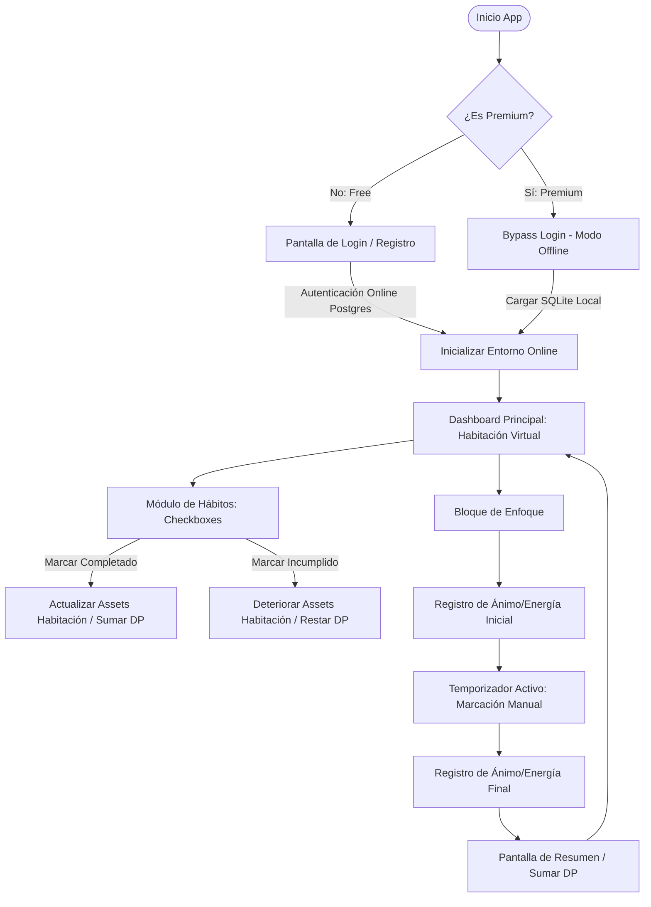

# Flujo de Recorrido del Usuario

Este documento detalla los flujos de navegación lógicos que experimentará el usuario al interactuar con FocusMind, diferenciando los caminos según el tipo de plan (Free vs. Premium).

---

## 1. Diagrama de Flujo Conceptual

---

## 2. Recorrido Detallado Paso a Paso

### Paso 1: Acceso e Inicialización (Login vs Bypass)
*   **Versión Free (Online):**
    *   La app inicia mostrando la pantalla de login/registro. El usuario debe ingresar su correo y contraseña.
    *   La app valida las credenciales contra la base de datos remota PostgreSQL.
    *   Si no hay conexión a internet, la app muestra un aviso de error indicando que se requiere conexión para el modo gratuito.
*   **Versión Premium (Offline):**
    *   La app detecta el estado Premium en el archivo de configuración local.
    *   Se omite por completo la pantalla de login (Bypass).
    *   Carga la base de datos local SQLite instantáneamente y accede a la interfaz.

### Paso 2: Dashboard Principal (Entorno Virtual)
*   Es la pantalla inicial tras el acceso.
*   Muestra el avatar y el entorno virtual interactivo actual (ej. Habitación).
*   El estado visual de la habitación refleja el comportamiento del usuario en las últimas 24 horas. Si el usuario no ha realizado sus tareas, verá una animación o imagen del espacio desordenado.
*   Muestra una barra de puntos de dopamina (DP) acumulados y el nivel del entorno.

### Paso 3: Módulo de Hábitos (La "Hoja de Papel")
*   Al navegar a esta sección, se presenta una interfaz minimalista que emula una "hoja de papel" con la lista de hábitos diarios.
*   **En la versión Free:** Solo se muestran los 3 hábitos fijos precargados (Tender la cama, Leer, Ordenar ropa).
*   **En la versión Premium:** Permite al usuario presionar un botón flotante `+` para añadir nuevos hábitos personalizados.
*   **Mecánica de Cumplimiento:**
    *   El usuario interactúa mediante checkboxes simples basados en su honestidad.
    *   Al marcar un hábito como *Cumplido*, suena un micro-sonido satisfactorio y el asset respectivo de la habitación pasa inmediatamente a su estado ordenado.
    *   Si el usuario desmarca el hábito, el entorno vuelve a su estado desordenado.

### Paso 4: Bloque de Enfoque (Temporizador)
*   El usuario inicia una sesión de concentración.
*   **Pre-registro:** Antes de arrancar el tiempo, aparece una ventana modal simple que solicita al usuario autoevaluar su **Energía** (1-5 estrellas) y **Motivación** (1-5 estrellas).
*   **Temporizador:** Se inicia un contador regresivo visual.
    *   *Nota de Diseño:* No se implementará bloqueo de pantalla estricto (para evitar permisos invasivos en Android). Se basa en el marcado manual de la sesión.
    *   El usuario puede pausar o cancelar la sesión de manera manual.
*   **Post-registro:** Al finalizar exitosamente el tiempo establecido, aparece otra modal para autoevaluar la **Energía** y **Motivación** finales.
*   **Recompensa:** Se muestran los puntos de dopamina ganados y se retorna al Dashboard con la actualización del entorno virtual.
