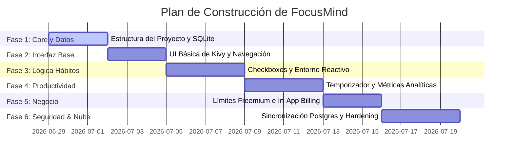

# Plan de Construcción y Roadmap de Desarrollo

Este documento detalla la secuencia exacta de construcción incremental de FocusMind. El enfoque está diseñado para mitigar fallos comunes de layouts en Kivy y asegurar la estabilidad de la aplicación a lo largo del proceso.

---

## Roadmap de Desarrollo por Fases

---

## Detalles de las Fases de Construcción

### Fase 1: Configuración de la Estructura y Base de Datos Inicial
*   **Objetivo:** Crear la estructura de directorios del proyecto Python/Kivy y configurar la base de datos local SQLite junto con los conectores e interfaces base.
*   **Tareas:**
    *   Definir la estructura de carpetas (`models/`, `views/`, `controllers/`, `assets/`).
    *   Implementar el script de inicialización de la base de datos SQLite con el esquema definido en `Backend.md`.
    *   Crear la interfaz de conexión `DatabaseConnector` con placeholders preparados para soportar el posterior cambio a PostgreSQL.

### Fase 2: UI Básica en Kivy y Sistema de Navegación
*   **Objetivo:** Desarrollar la interfaz gráfica esquelética y el ruteador de pantallas utilizando `ScreenManager` de Kivy.
*   **Tareas:**
    *   Configurar el archivo principal `main.py` y el archivo de diseño estructurado `focusmind.kv`.
    *   Definir las vistas principales:
        *   `LoginScreen` / `Bypass`
        *   `DashboardScreen` (Contenedor del Entorno Virtual)
        *   `HabitsScreen` (La lista en papel)
        *   `FocusScreen` (El temporizador)
        *   `AnalyticsScreen` (Dashboard de métricas)
    *   Implementar una barra de navegación inferior minimalista y fluida.

### Fase 3: Lógica de Hábitos y Actualización del Entorno Reactivo
*   **Objetivo:** Conectar el estado de los hábitos con la renderización dinámica de los assets del entorno de la habitación.
*   **Tareas:**
    *   Implementar el controlador de hábitos (`HabitController`) que lee y escribe el estado de cumplimiento en la base de datos.
    *   Integrar los assets visuales ordenados/desordenados (`bed_messy.png` / `bed_clean.png`, etc.) en el Canvas/Widgets de la `DashboardScreen`.
    *   Establecer la mecánica de recálculo de Puntos de Dopamina (DP) en tiempo real al marcar o desmarcar hábitos.

### Fase 4: Temporizador de Enfoque y Telemetría Analítica
*   **Objetivo:** Construir el módulo de enfoque interactivo con autoevaluación y recolección de métricas.
*   **Tareas:**
    *   Implementar el widget del temporizador regresivo simple usando `Clock` de Kivy.
    *   Crear diálogos modales para capturar los niveles de energía y motivación pre/post sesión.
    *   Guardar los resultados de la sesión en la tabla `Historial_Dopamina`.
    *   Diseñar una gráfica de barras o líneas nativa en Kivy para mostrar el histórico de energía/motivación.

### Fase 5: Límites Freemium y Placeholders de Monetización
*   **Objetivo:** Aplicar las restricciones comerciales de la versión gratuita y preparar la monetización.
*   **Tareas:**
    *   Implementar lógica de control de slots diarios de enfoque (límite de 1.5 ejecuciones diarias para planes Free).
    *   Bloquear la creación de hábitos personalizados para la versión Free (mostrando únicamente los 3 predefinidos).
    *   Crear los adaptadores de integración móvil (`AdManager` y `BillingManager`) con mockups funcionales para pruebas locales.

### Fase 6: Sincronización en la Nube (Postgres) e Integración de Seguridad
*   **Objetivo:** Integrar la base de datos remota para usuarios Free y robustecer la seguridad del software de cara a la Play Store.
*   **Tareas:**
    *   Implementar el conector Postgres en el backend y habilitar el canal de sincronización HTTPS.
    *   Aplicar validaciones y parametrización estricta de consultas SQL en toda la capa de persistencia para evitar inyecciones de código.
    *   Configurar los parámetros de ofuscación de código y uso de ProGuard dentro de `buildozer.spec`.
    *   Implementar mecanismos de almacenamiento seguro para tokens de sesión.
