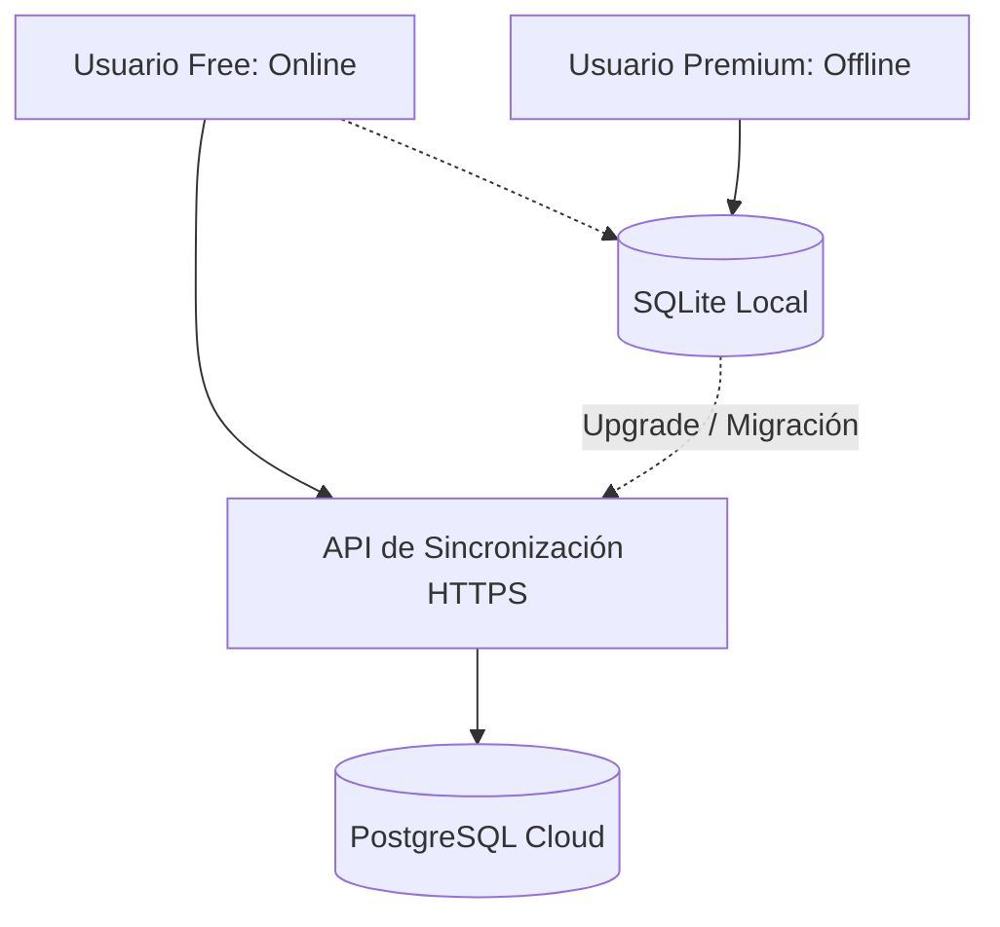

# TRD - Documento de Requisitos Técnicos (Technical Requirement Document)

## 1. Requerimientos del Sistema (Multiplataforma y Android)
El desarrollo y despliegue de FocusMind se basará en el ecosistema Python, utilizando Kivy como framework de interfaz de usuario, orientado principalmente a dispositivos móviles (Android) mediante Buildozer.

### 1.1. Dependencias de Software
*   **Python:** 3.9+ (versión recomendada para compatibilidad óptima con Buildozer y dependencias móviles).
*   **Kivy:** 2.2.0+ (Framework principal de interfaz gráfica).
*   **KivyMD (Opcional, según diseño):** Para widgets basados en Material Design si se requiere acelerar layouts.
*   **Buildozer:** Para empaquetar en Android (APK/AAB).
*   **SQLite3:** Módulo nativo de Python para persistencia de datos local.
*   **Psycopg2-binary o pg8000:** Driver de PostgreSQL compatible con entornos compilados de Python.

---

## 2. Arquitectura de Datos Híbrida

FocusMind opera bajo dos paradigmas de almacenamiento según el tipo de plan:



### 2.1. Estrategia de Persistencia y Sincronización
1.  **Modo Gratuito (Online - PostgreSQL):**
    *   Los datos se almacenan directamente en la base de datos PostgreSQL remota.
    *   Se requiere una conexión de red activa. Cada transacción (check de hábito, fin de bloque de enfoque) realiza una petición de actualización.
    *   Se implementa una caché temporal local mínima para prevenir la pérdida de datos en micro-cortes de red.
2.  **Modo Premium (Offline - SQLite):**
    *   La aplicación trabaja 100% de manera local sobre un archivo SQLite almacenado en el sandbox seguro del dispositivo.
    *   No se realizan llamadas de red a bases de datos remotas.
3.  **Migración de Free a Premium:**
    *   Al pasar de Free a Premium, se inicia un proceso de exportación única desde PostgreSQL hacia la base de datos local SQLite del dispositivo, desactivando posteriormente las llamadas de sincronización online.

---

## 3. Sistema de Monetización Modular

Para mantener el código limpio y desacoplado, los servicios de monetización se estructuran mediante interfaces abstractas y placeholders que encapsulan la lógica de la plataforma.

### 3.1. Google Mobile Ads (AdMob)
La integración con AdMob se gestiona a través de una fachada que utiliza `pyjnius` para interactuar con las APIs de Android de Google Play Services:

```python
# Módulo de interfaz para anuncios (placeholders estructurados)
class AdManagerBase:
    def initialize(self):
        pass
    def show_banner(self):
        pass
    def hide_banner(self):
        pass
    def show_interstitial(self):
        pass

class AndroidAdManager(AdManagerBase):
    """Implementación real usando pyjnius para Android"""
    # En desarrollo o no-Android, este Manager cae en un fallback simulado.
    pass
```

### 3.2. Google Play Billing (Compras Integradas)
Para la transición de la versión gratuita a la Premium se utiliza una clase base que interactúa con la API de facturación de Google Play mediante `plyer` o `pyjnius`:

```python
class BillingManagerBase:
    def query_purchases(self):
        pass
    def purchase_premium(self, callback):
        pass

class AndroidBillingManager(BillingManagerBase):
    """Manejo de compras in-app en Android"""
    pass
```

---

## 4. Directrices de Seguridad para Google Play Store

Para garantizar la aprobación de la aplicación en la Google Play Store y proteger la integridad de los datos de los usuarios, se establecen las siguientes reglas de seguridad obligatorias:

### 4.1. Cifrado en Tránsito
*   Todas las conexiones externas hacia la base de datos o API de PostgreSQL deben realizarse a través de HTTPS estricto con TLS 1.2 o superior.
*   Queda estrictamente prohibida la comunicación por HTTP plano.

### 4.2. Ofuscación de Código (Buildozer/ProGuard)
*   En la configuración de `buildozer.spec`, se debe configurar el soporte de ProGuard para ofuscar las clases Java generadas por el wrapper de Kivy.
*   Para el código Python, se utilizará empaquetado optimizado (`pyo` o pre-compilación a bytecode) para dificultar la ingeniería inversa.

### 4.3. Almacenamiento Seguro de Credenciales
*   No almacenar contraseñas en texto plano. Las contraseñas en PostgreSQL se almacenan utilizando hashes robustos (ej: `bcrypt` o `pbkdf2`).
*   Los tokens de sesión locales (para usuarios Free) se almacenarán utilizando el Keychain/Keystore del sistema operativo mediante librerías seguras o el sandbox privado del usuario que Android aísla por defecto.

### 4.4. Prevención de Inyecciones SQL (SQLi)
*   **Parámetros Obligatorios:** Todas las consultas SQL, tanto en SQLite como en PostgreSQL, deben utilizar consultas parametrizadas. Queda terminantemente prohibido concatenar cadenas de texto para construir sentencias SQL.
    ```python
    # CORRECTO:
    cursor.execute("SELECT * FROM Usuarios WHERE email = ?", (user_email,))
    
    # INCORRECTO:
    cursor.execute(f"SELECT * FROM Usuarios WHERE email = '{user_email}'")
    ```
