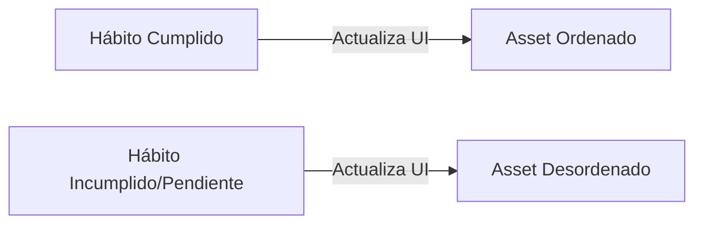

# UI/UX - Apariencia y Experiencia de Usuario

## 1. Guía de Diseño para Kivy
La interfaz gráfica de FocusMind debe ser limpia, moderna y visualmente atractiva, rompiendo con el esquema de aplicaciones de productividad monótonas tipo "lista de tareas". Se implementa un estilo visual híbrido: minimalista en los menús de control, y dinámico/interactivo en la pantalla del entorno virtual.

### 1.1. Paleta de Colores (Diseño Premium)
*   **Fondo Principal (Oscuro):** `#121214` (Gris oscuro profundo que reduce la fatiga visual).
*   **Superficies/Tarjetas:** `#1D1D2F` (Azul oscuro violáceo con un toque de profundidad).
*   **Acento Primario (Dopamina/Energía):** `#8B5CF6` (Morado vibrante).
*   **Cumplimiento (Positivo):** `#10B981` (Verde esmeralda para el éxito).
*   **Incumplimiento/Advertencia (Negativo):** `#EF4444` (Rojo coral para penalizaciones o desorden).
*   **Texto Principal:** `#F3F4F6` (Blanco grisáceo de alto contraste).

### 1.2. Tipografía
*   Se evitarán las tipografías por defecto del sistema. Se integrará la tipografía **Outfit** o **Inter** mediante la carga de fuentes personalizadas en Kivy (`Label(font_name='assets/fonts/Outfit-Regular.ttf')`).

---

## 2. Gamificación Visual y Entorno Virtual

El núcleo del feedback visual de FocusMind es el widget del entorno, el cual cambia en tiempo real dependiendo del cumplimiento de los hábitos diarios del usuario.

### 2.1. Nivel Inicial (Gratuito): La Habitación Virtual
La pantalla de inicio renderiza una habitación minimalista en perspectiva isométrica o 2D plana mediante widgets superpuestos (`FloatLayout` o `Canvas` en Kivy).
*   **Hábito 1: Tender la cama (Predefinido)**
    *   *Estado Incumplido/Pendiente:* Asset `bed_messy.png` (sábanas caídas, almohada tirada).
    *   *Estado Cumplido:* Asset `bed_clean.png` (cama perfectamente tendida y ordenada).
*   **Hábito 2: Leer páginas (Predefinido)**
    *   *Estado Incumplido/Pendiente:* Asset `bookshelf_messy.png` (libros desparramados en el suelo).
    *   *Estado Cumplido:* Asset `bookshelf_clean.png` (libros alineados en el estante virtual).
*   **Hábito 3: Ordenar ropa (Predefinido)**
    *   *Estado Incumplido/Pendiente:* Asset `chair_messy.png` (ropa acumulada encima de la silla).
    *   *Estado Cumplido:* Asset `chair_clean.png` (silla despejada y ordenada).

### 2.2. Niveles Avanzados (Premium): Expansión del Entorno
Al desbloquear la versión Premium, los usuarios pueden expandir su entorno virtual ganando acceso a nuevas áreas desbloqueables con sus puntos de dopamina:
*   **La Casa Completa:** Incluye Cocina, Sala de Estar y Jardín (nuevos hábitos vinculados a la alimentación y el bienestar físico).
*   **La Oficina:** Incluye Escritorio de Trabajo avanzado, Pizarra de Metas y Cafetera virtual (enfocado en hábitos de productividad profesional y estudios).

---

## 3. Diseño de Dashboards y Gráficas de Análisis

El dashboard analítico se sitúa en una pantalla secundaria y recopila las métricas de energía y motivación pre/post bloque de enfoque.

*   **Gráfica de Dopamina (Progreso):** Gráfica de línea simple (generada con canvas de Kivy de forma nativa para evitar dependencias pesadas de matplotlib) que muestra los puntos de dopamina acumulados en la última semana.
*   **Matriz de Energía vs Motivación:**
    *   Un panel visual de cuadrantes (Energía en eje Y, Motivación en eje X) que mapea en qué estado se inician las sesiones de enfoque y cómo finalizan.
    *   Se usarán esferas de colores (morado para pre-enfoque, verde para post-enfoque) conectadas por una línea de transición para reflejar visualmente la ganancia de enfoque.
